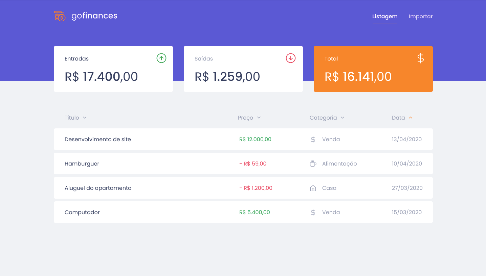
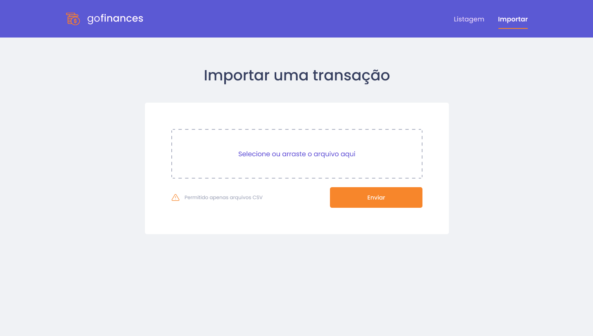

<h1 align="center">
      
</h1>

<h3 align="center">
 GoFinances
</h3>

Transaction management application, with Node.js along with TypeScript, but this time including the use of databases with TypeORM and sending files with Multer

  <a href="#rocket-technologies">Technologies</a>&nbsp;&nbsp;&nbsp;|&nbsp;&nbsp;&nbsp;
  <a href="#-how-to-use">How to use</a>&nbsp;&nbsp;&nbsp;|&nbsp;&nbsp;&nbsp;
  <a href="#memo-license">License</a>

  

     
      

 
 

## :rocket: Technologies

 
This app features all the latest tools and practices in mobile development!
 
 

- [React](https://reactjs.org/)
- [React Native](https://facebook.github.io/react-native/)
- [Node JS](https://nodejs.org/en/)
- [TypeScript](https://www.typescriptlang.org/)
- [Axios](https://github.com/axios/axios)

## 📢 How to use

 

**📡 Backend (Node Js)**

 

Step 1 - Access our application's node server folder with the command: `cd server`;

Step 2 - Download the npm packages used in the project with the command: `npm install` , if you prefer yarn execute `yarn`;

Step 3 - Start the server with the command: `npm run dev`, if you prefer yarn run `yarn dev`;

- Node Server is required for both the frontend and the mobile.
- it is necessary to have a postgres database with the name `gofinances`.

 
 

**💻 Frontend (React Js)**

 

Step 1 - Access our application's frontend folder with the command: `cd web`;

Step 2 - Download the npm packages used in the project with the command: `npm install` , if you prefer yarn execute `yarn`;

Step 3 - Start the application with the command: `npm run start`, if you prefer yarn run `yarn start`;

 
 

**📱 Mobile (React Native)**

 

Step 1 - Access our application's mobile folder with the command: `yarn`;

Step 2 - Download the npm packages used in the project with the command: `npm install` , if you prefer yarn execute `yarn`;

Step 3 - Change `baseURL` in ./src/services/apiClient.ts, for the ip of your machine, this is important because the localhost would be the ip of the device or emulator and we need the ip of the server.;

Step 4 - Start the application with the command: `npm run start`, if you prefer yarn run `yarn start`;

 
 

## :memo: License

 
This project is licensed under the MIT License - see the details in <a href="https://opensource.org/licenses/MIT">page</a>.

---

Make with :purple_heart:
